## Diagram

```mermaid
erDiagram

    addresses {
        id uuid PK "not null"
        site_id uuid FK "null"
        ban_id character_varying "not null"
        city character_varying "not null"
        city_code character_varying "not null"
        post_code character_varying "not null"
        value character_varying "not null"
        street_name character_varying "null"
        street_number character_varying "null"
        lat numeric "null"
        long numeric "null"
    }

    carbon_storage {
        id integer PK "not null"
        localisation_category character_varying "not null"
        localisation_code character_varying "not null"
        reservoir character_varying "not null"
        soil_category character_varying "not null"
        stock_tC_by_ha character_varying "not null"
    }

    cities {
        insee character_varying PK "not null"
        department character_varying "not null"
        epci character_varying "not null"
        name character_varying "not null"
        region character_varying "not null"
        zpc character_varying "not null"
        id integer "not null"
        code_bassin_populicole character_varying "null"
        code_greco text[] "null"
        code_groupeser text[] "null"
        code_ser text[] "null"
    }

    knex_migrations {
        id integer PK "not null"
        name character_varying "null"
        batch integer "null"
        migration_time timestamp_with_time_zone "null"
    }

    knex_migrations_lock {
        index integer PK "not null"
        is_locked integer "null"
    }

    reconversion_project_development_plan_costs {
        id uuid PK "not null"
        development_plan_id uuid FK "not null"
        purpose character_varying "not null"
        amount numeric "null"
    }

    reconversion_project_development_plans {
        id uuid PK "not null"
        reconversion_project_id uuid FK "not null"
        type character_varying "not null"
        features json "not null"
        developer_name character_varying "null"
        developer_structure_type character_varying "null"
        schedule_end_date timestamp_with_time_zone "null"
        schedule_start_date timestamp_with_time_zone "null"
    }

    reconversion_project_financial_assistance_revenues {
        id uuid PK "not null"
        reconversion_project_id uuid FK "not null"
        source character_varying "not null"
        amount numeric "null"
    }

    reconversion_project_reinstatement_costs {
        id uuid PK "not null"
        reconversion_project_id uuid FK "not null"
        purpose character_varying "not null"
        amount numeric "null"
    }

    reconversion_project_soils_distributions {
        id uuid PK "not null"
        reconversion_project_id uuid FK "not null"
        soil_type character_varying "not null"
        surface_area numeric "not null"
    }

    reconversion_project_yearly_expenses {
        id uuid PK "not null"
        reconversion_project_id uuid FK "not null"
        purpose character_varying "not null"
        amount numeric "not null"
    }

    reconversion_project_yearly_revenues {
        id uuid PK "not null"
        reconversion_project_id uuid FK "not null"
        source character_varying "not null"
        amount numeric "not null"
    }

    reconversion_projects {
        id uuid PK "not null"
        related_site_id uuid FK "not null"
        name character_varying "not null"
        created_at timestamp_with_time_zone "not null"
        id uuid "not null"
        creation_mode character_varying "null"
        future_operator_name character_varying "null"
        future_operator_structure_type character_varying "null"
        future_site_owner_name character_varying "null"
        future_site_owner_structure_type character_varying "null"
        project_phase character_varying "null"
        reinstatement_contract_owner_name character_varying "null"
        reinstatement_contract_owner_structure_type character_varying "null"
        operations_first_year integer "null"
        friche_decontaminated_soil_surface_area numeric "null"
        site_purchase_property_transfer_duties numeric "null"
        site_purchase_selling_price numeric "null"
        site_resale_expected_property_transfer_duties numeric "null"
        site_resale_expected_selling_price numeric "null"
        description text "null"
        reinstatement_schedule_end_date timestamp_with_time_zone "null"
        reinstatement_schedule_start_date timestamp_with_time_zone "null"
        created_by uuid "null"
    }

    site_expenses {
        id uuid PK "not null"
        site_id uuid FK "null"
        bearer character_varying "not null"
        purpose character_varying "not null"
        purpose_category character_varying "not null"
        amount numeric "not null"
    }

    site_incomes {
        id uuid PK "not null"
        site_id uuid FK "null"
        source character_varying "not null"
        amount numeric "not null"
    }

    site_soils_distributions {
        id uuid PK "not null"
        site_id uuid FK "null"
        soil_type character_varying "not null"
        surface_area numeric "not null"
    }

    sites {
        id uuid PK "not null"
        is_friche boolean "not null"
        name character_varying "not null"
        owner_structure_type character_varying "not null"
        surface_area numeric "not null"
        created_at timestamp_with_time_zone "not null"
        friche_has_contaminated_soils boolean "null"
        creation_mode character_varying "null"
        friche_activity character_varying "null"
        owner_name character_varying "null"
        tenant_name character_varying "null"
        tenant_structure_type character_varying "null"
        friche_accidents_deaths integer "null"
        friche_accidents_minor_injuries integer "null"
        friche_accidents_severe_injuries integer "null"
        friche_contaminated_soil_surface_area numeric "null"
        description text "null"
        created_by uuid "null"
    }

    users {
        id uuid PK "not null"
        email character_varying "not null"
        created_at timestamp_with_time_zone "not null"
        personal_data_storage_consented_at timestamp_with_time_zone "not null"
        firstname character_varying "null"
        lastname character_varying "null"
        structure_activity character_varying "null"
        structure_name character_varying "null"
        structure_type character_varying "null"
        personal_data_analytics_use_consented_at timestamp_with_time_zone "null"
        personal_data_communication_use_consented_at timestamp_with_time_zone "null"
    }

    users_deprecated {
        email character_varying "not null"
        password character_varying "not null"
        id uuid "not null"
    }

    reconversion_project_development_plans ||--o{ reconversion_project_development_plan_costs : "reconversion_project_development_plan_costs(development_plan_id) -> reconversion_project_development_plans(id)"
    reconversion_projects ||--o{ reconversion_project_development_plans : "reconversion_project_development_plans(reconversion_project_id) -> reconversion_projects(id)"
    reconversion_projects ||--o{ reconversion_project_financial_assistance_revenues : "reconversion_project_financial_assistance_revenues(reconversion_project_id) -> reconversion_projects(id)"
    reconversion_projects ||--o{ reconversion_project_reinstatement_costs : "reconversion_project_reinstatement_costs(reconversion_project_id) -> reconversion_projects(id)"
    reconversion_projects ||--o{ reconversion_project_soils_distributions : "reconversion_project_soils_distributions(reconversion_project_id) -> reconversion_projects(id)"
    reconversion_projects ||--o{ reconversion_project_yearly_expenses : "reconversion_project_yearly_expenses(reconversion_project_id) -> reconversion_projects(id)"
    reconversion_projects ||--o{ reconversion_project_yearly_revenues : "reconversion_project_yearly_revenues(reconversion_project_id) -> reconversion_projects(id)"
    sites ||--o{ addresses : "addresses(site_id) -> sites(id)"
    sites ||--o{ reconversion_projects : "reconversion_projects(related_site_id) -> sites(id)"
    sites ||--o{ site_expenses : "site_expenses(site_id) -> sites(id)"
    sites ||--o{ site_incomes : "site_incomes(site_id) -> sites(id)"
    sites ||--o{ site_soils_distributions : "site_soils_distributions(site_id) -> sites(id)"
```

## Indexes

### `addresses`

- `addresses_id_unique`
- `addresses_pkey`

### `carbon_storage`

- `carbon_storage_pkey`

### `cities`

- `cities_pkey`

### `knex_migrations`

- `knex_migrations_pkey`

### `knex_migrations_lock`

- `knex_migrations_lock_pkey`

### `reconversion_project_development_plan_costs`

- `reconversion_project_development_plan_costs_id_unique`
- `reconversion_project_development_plan_costs_pkey`

### `reconversion_project_development_plans`

- `reconversion_project_development_plans_id_unique`
- `reconversion_project_development_plans_pkey`

### `reconversion_project_financial_assistance_revenues`

- `reconversion_project_financial_assistance_revenues_id_unique`
- `reconversion_project_financial_assistance_revenues_pkey`

### `reconversion_project_reinstatement_costs`

- `reconversion_project_reinstatement_costs_id_unique`
- `reconversion_project_reinstatement_costs_pkey`

### `reconversion_project_soils_distributions`

- `reconversion_project_soils_distributions_id_unique`
- `reconversion_project_soils_distributions_pkey`

### `reconversion_project_yearly_expenses`

- `reconversion_project_yearly_expenses_id_unique`
- `reconversion_project_yearly_expenses_pkey`

### `reconversion_project_yearly_revenues`

- `reconversion_project_yearly_revenues_id_unique`
- `reconversion_project_yearly_revenues_pkey`

### `reconversion_projects`

- `reconversion_projects_id_unique`
- `reconversion_projects_pkey`

### `site_expenses`

- `site_expenses_id_unique`
- `site_expenses_pkey`

### `site_incomes`

- `site_incomes_id_unique`
- `site_incomes_pkey`

### `site_soils_distributions`

- `site_soils_distributions_id_unique`
- `site_soils_distributions_pkey`

### `sites`

- `sites_id_unique`
- `sites_pkey`

### `users`

- `users_pkey`
