## Diagram

```mermaid
erDiagram

    carbon_storage {
        id integer PK "not null"
        localisation_category character_varying "not null"
        localisation_code character_varying "not null"
        reservoir character_varying "not null"
        soil_category character_varying "not null"
        stock_tC_by_ha character_varying "not null"
    }

    cities {
        insee character_varying PK "not null"
        department character_varying "not null"
        epci character_varying "not null"
        name character_varying "not null"
        region character_varying "not null"
        zpc character_varying "not null"
        id integer "not null"
        code_bassin_populicole character_varying "null"
        code_greco text[] "null"
        code_groupeser text[] "null"
        code_ser text[] "null"
    }

    knex_migrations {
        id integer PK "not null"
        name character_varying "null"
        batch integer "null"
        migration_time timestamp_with_time_zone "null"
    }

    knex_migrations_lock {
        index integer PK "not null"
        is_locked integer "null"
    }

    users {
        id uuid PK "not null"
        email character_varying "not null"
        created_at timestamp_with_time_zone "not null"
        personal_data_storage_consented_at timestamp_with_time_zone "not null"
        firstname character_varying "null"
        lastname character_varying "null"
        structure_activity character_varying "null"
        structure_name character_varying "null"
        structure_type character_varying "null"
        personal_data_analytics_use_consented_at timestamp_with_time_zone "null"
        personal_data_communication_use_consented_at timestamp_with_time_zone "null"
    }

    users_deprecated {
        email character_varying "not null"
        password character_varying "not null"
        id uuid "not null"
    }
```

## Indexes

### `carbon_storage`

- `carbon_storage_pkey`

### `cities`

- `cities_pkey`

### `knex_migrations`

- `knex_migrations_pkey`

### `knex_migrations_lock`

- `knex_migrations_lock_pkey`

### `users`

- `users_pkey`
