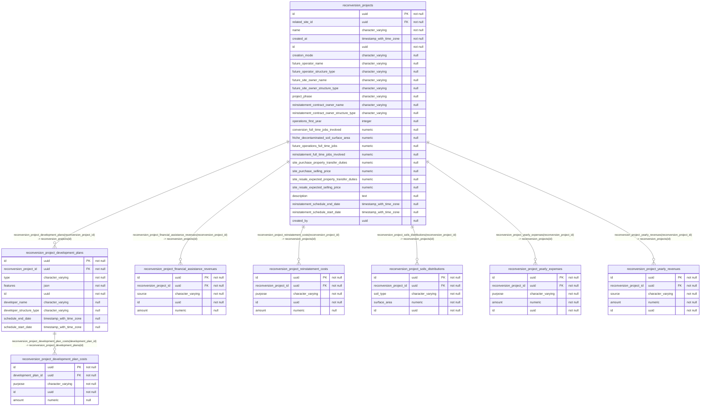

## Diagram

## Indexes

### `reconversion_project_development_plan_costs`

- `reconversion_project_development_plan_costs_id_unique`
- `reconversion_project_development_plan_costs_pkey`

### `reconversion_project_development_plans`

- `reconversion_project_development_plans_id_unique`
- `reconversion_project_development_plans_pkey`

### `reconversion_project_financial_assistance_revenues`

- `reconversion_project_financial_assistance_revenues_id_unique`
- `reconversion_project_financial_assistance_revenues_pkey`

### `reconversion_project_reinstatement_costs`

- `reconversion_project_reinstatement_costs_id_unique`
- `reconversion_project_reinstatement_costs_pkey`

### `reconversion_project_soils_distributions`

- `reconversion_project_soils_distributions_id_unique`
- `reconversion_project_soils_distributions_pkey`

### `reconversion_project_yearly_expenses`

- `reconversion_project_yearly_expenses_id_unique`
- `reconversion_project_yearly_expenses_pkey`

### `reconversion_project_yearly_revenues`

- `reconversion_project_yearly_revenues_id_unique`
- `reconversion_project_yearly_revenues_pkey`

### `reconversion_projects`

- `reconversion_projects_id_unique`
- `reconversion_projects_pkey`
